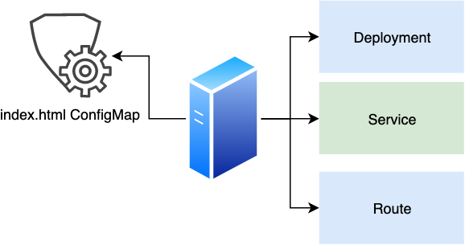

## Hello World K8S Operator tutorial with Operator SDK, OpenShift and Ansible

This guide walks through an example of building a simple hw-operator using the `operator-sdk` CLI tool.

### Prerequisites 
1. [Python3](https://www.python.org/)
2. [Pipenv](https://pipenv.pypa.io/en/latest/#install-pipenv-today) 
3. [Operator SDK CLI v0.13.0](https://github.com/operator-framework/operator-sdk/releases/tag/v0.13.0)
4. [OpenShift client (oc command)](https://mirror.openshift.com/pub/openshift-v4/clients/ocp/latest/)
5. OpenShift cluster
6. Optional - IDE with Golang support ([VSCode](https://code.visualstudio.com/download), [GoLand](https://www.jetbrains.com/go), etc..)


### Let's start

As for example, we going to implement simple hw-operator which will encode operational logic of deploying a new Nginx web server with single website. The website will be constructed from basic HTML code.
The hw-operator operator will take care of the following K8S/OpenShift objects
* Deployment
* Service
* Router
* ConfigMap with basic HTML code

### The operator diagram



### Project setup 
Let’s start from creating development environment for Ansible Operator 

```bash
# Create environment for k9S Operators development
mkdir -p my-operators && cd my-operators
operator-sdk new hw-operator --api-version=<YOUR-NAME>.okto.io/v1alpha1 --kind=<YOUR-NAME>HelloWorld --type=ansible
cd hw-operator
# Create environment for Ansible development 
pipenv --python 3
pipenv install ansible ansible-runner openshift ansible-runner-http
```
