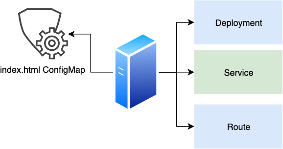

## Hello World K8S Operator tutorial with Operator SDK and OpenShift

This guide walks through an example of building a simple hw-operator using the `operator-sdk` CLI tool.

### Prerequisites 
1. [Golang](https://golang.org/doc/install) 
2. [Operator SDK CLI v0.13.0](https://github.com/operator-framework/operator-sdk/releases/tag/v0.13.0)
3. [OpenShift client (oc command)](https://mirror.openshift.com/pub/openshift-v4/clients/ocp/latest/)
4. OpenShift cluster
5. Optional - IDE with Golang support ([VSCode](https://code.visualstudio.com/download), [GoLand](https://www.jetbrains.com/go), etc..)


### Let's start

As for example, we going to implement simple hw-operator which will encode operational logic of deploying a new Nginx web server with single website. The website will be constructed from basic HTML code.
The hw-operator operator will take care of the following K8S/OpenShift objects
* Deployment
* Service
* Router
* ConfigMap with basic HTML code

### The operator diagram



### Project setup 
Let’s start from creating directory and [operator project layout](https://github.com/operator-framework/operator-sdk/blob/master/doc/project_layout.md)

```bash
mkdir -p $GOPATH/src/github.com
cd $GOPATH/src/github.com
operator-sdk new hw-operator --vendor=true
cd hw-operator
```

Now, when we’ve created our empty operator project, let’s generate our first API. 
Generate new Custom Resource Definition(CRD) API called <YOUR-NAME>HelloWorld, 
with API version `<YOUR-NAME>.hw.okto.io/v1alpha1` and Kind `<YOUR-NAME>HelloWorld`.

```bash
operator-sdk add api --api-version=<YOUR-NAME>.hw.okto.io/v1alpha1 --kind=<YOUR-NAME>HelloWorld
```
This will scaffold the HelloWorld resource API under `pkg/apis/<YOUR-NAME>/v1alpha1/...`

Define the `spec` and `status` by modifying the `spec` and `status` go structs 
of the `HelloWorld` Custom Resource(CR) 
at `pkg/apis/<YOUR-NAME>/v1alpha1/<YOUR-NAME>helloworld_types.go`.

Update the `<YOUR-NAME>HelloWorldSpec` struct to

```go
type <YOUR-NAME>HelloWorldSpec struct {
 Message string `json:"message"`
}
```

Update the `<YOUR-NAME>HelloWorldStatus` struct to

```go
type <YOUR-NAME>HelloWorldStatus struct {
 Message string `json:"message"`
}
```

After modifying the `*_types.go` file always run the following command to update the generated code for that resource type

```bash
operator-sdk generate k8s
```

Also, update the CRD file at `deploy/crds/<YOUR-NAME>.hw.okto.io_<YOUR-NAME>helloworlds_crd.yaml` 
by running the following command
```bash
 operator-sdk generate crds
``` 

After each new code generation, or importing new library, do not forget to run the following command
```bash
go mod vendor
```

Add a new `Controller` to the project that will watch and reconcile the `HelloWorld` resource 
```bash
operator-sdk add controller --api-version=<YOUR-NAME>.hw.okto.io/v1alpha1 --kind=<YOUR-NAME>HelloWorld
```
This will scaffold a new `Controller` 
implementation under `pkg/controller/<YOUR-NAME>helloworld/<YOUR-NAME>helloworld_controller.go`

Since `hw-operator` will use OpenShift Route for exposing the website to external access, we’ll have to register [3rd Party Resources](https://github.com/operator-framework/operator-sdk/blob/master/doc/user-guide.md#adding-3rd-party-resources-to-your-operator) to the `hw-operator`

Edit the `cmd/manager/main.go` and add the following code

1. To the import section add the following
    ```go
    routev1 "github.com/openshift/api/route/v1"
    ```
2. To the main function, add the following code. **Note**, your 3rd party resource needs to be added above the `// Setup all Controllers`, (e.g the 3rd party resource should be added before the controller) comment, also, don’t forget to run the `go mod vendor` to update vendor directory.

    ```go
    // Adding the routev1
    if err := routev1.Install(mgr.GetScheme()); err != nil {
      log.Error(err, "")
      os.Exit(1)
    }
    ```
    
Edit the `pkg/controller/<YOUR-NAME>helloworld/<YOUR-NAME>helloworld_controller.go` and apply our operator logic.
First, remove the autogenerated functions from that file
1. Find and completely remove whole `newPodForCR` function
2. Find the `Reconcile` function and leave it empty, this is how your `Reconcile` function should looks like after editing
   ```go
    func (r *Reconcile<YOUR-NAME>HelloWorld) Reconcile(request reconcile.Request) (reconcile.Result, error) {
    
      return reconcile.Result{}, nil
    }
   ```
3. Find the `add` function, and remove autogenerated code, this is how your `add` function should looks likes after editing
    ```go
    func add(mgr manager.Manager, r reconcile.Reconciler) error {
      // Create a new controller
      c, err := controller.New("<YOUR-NAME>helloworld-controller", mgr, controller.Options{Reconciler: r})
      if err != nil {
        return err
      }
    
      // Watch for changes to primary resource <YOUR-NAME>HelloWorld
      err = c.Watch(&source.Kind{Type: &<YOUR-NAME>v1alpha1.<YOUR-NAME>HelloWorld{}}, &handler.EnqueueRequestForObject{})
      if err != nil {
        return err
      }
    
    
      return nil
    }
    ```

Add watches for each K8S object that `hw-operator` should manage by 
updating the `pkg/controller/<YOUR-NAME>helloworld/<YOUR-NAME>helloworld_controller.go`. 
1. Add required imports
    ```go
    corev1 "k8s.io/api/core/v1"
    routev1 "github.com/openshift/api/route/v1"
    ```
2. Add to the `add` function following code
    ```go
      // Watch for changes to Service
      err = c.Watch(&source.Kind{Type: &corev1.Service{}}, &handler.EnqueueRequestForOwner{
        IsController: true,
        OwnerType:    &<YOUR-NAME>v1alpha1.<YOUR-NAME>HelloWorld{},
      })
      if err != nil {
        return err
      }
      // Watch for changes to ConfigMap
      err = c.Watch(&source.Kind{Type: &corev1.ConfigMap{}}, &handler.EnqueueRequestForOwner{
        IsController: true,
        OwnerType:    &<YOUR-NAME>v1alpha1.<YOUR-NAME>HelloWorld{},
      })
      if err != nil {
        return err
      }
      // Watch for changes to Route
      err = c.Watch(&source.Kind{Type: &routev1.Route{}}, &handler.EnqueueRequestForOwner{
        IsController: true,
        OwnerType:    &<YOUR-NAME>v1alpha1.<YOUR-NAME>HelloWorld{},
      })
      if err != nil {
        return err
      }
    ```
    
Now, when we’ve created our watches, let’s build the Reconcile functionality.
But first add the following functions to `pkg/controller/<YOUR-NAME>helloworld/<YOUR-NAME>helloworld_controller.go`

1. Add to import
    ```go
    "context"
    appsv1 "k8s.io/api/apps/v1"
    metav1 "k8s.io/apimachinery/pkg/apis/meta/v1"
    "sigs.k8s.io/controller-runtime/pkg/controller/controllerutil"
    ``` 
2. `manageDeployment`
    ```go
    // Reconcile loop resources managers functions
    func (r *Reconcile<YOUR-NAME>HelloWorld) manageDeployment(hw *<YOUR-NAME>v1alpha1.<YOUR-NAME>HelloWorld, reqLogger logr.Logger) (*reconcile.Result, error) {
      deployment := &appsv1.Deployment{}
      err := r.client.Get(context.TODO(), types.NamespacedName{Name: hw.Name, Namespace: hw.Namespace}, deployment)
      if err != nil && errors.IsNotFound(err) {
        serverDeployment, err := r.deploymentForWebServer(hw)
        if err != nil {
          reqLogger.Error(err, "error getting server deployment")
          return &reconcile.Result{}, err
        }
        reqLogger.Info("Creating a new server deployment.", "Deployment.Namespace", serverDeployment.Namespace, "Deployment.Name", serverDeployment.Name)
        err = r.client.Create(context.TODO(), serverDeployment)
        if err != nil {
          reqLogger.Error(err, "Failed to create new Server Deployment.", "Deployment.Namespace", serverDeployment.Namespace, "Deployment.Name", serverDeployment.Name)
          return &reconcile.Result{}, err
        }
        return &reconcile.Result{Requeue: true}, nil
      } else if err != nil {
        reqLogger.Error(err, "Failed to get server deployment.")
        return &reconcile.Result{}, err
      }
      return nil, nil
    }
    ```
3. `manageRoute`
    ```go
    func (r *Reconcile<YOUR-NAME>HelloWorld) manageRoute(hw *<YOUR-NAME>v1alpha1.<YOUR-NAME>HelloWorld, reqLogger logr.Logger) (*reconcile.Result, error) {
      //Check if route already exists, if not create a new one
      route := &routev1.Route{}
      err := r.client.Get(context.TODO(), types.NamespacedName{Name: hw.Name, Namespace: hw.Namespace}, route)
      if err != nil && errors.IsNotFound(err) {
        serverRoute, err := r.routeForWebServer(hw)
        if err != nil {
          reqLogger.Error(err, "error getting server route")
          return &reconcile.Result{}, err
        }
        reqLogger.Info("Creating a new route.", "Route.Namespace", serverRoute.Namespace, "Router.Name", serverRoute.Name)
        err = r.client.Create(context.TODO(), serverRoute)
        if err != nil {
          reqLogger.Error(err, "Failed to create new Server Route.", "Route.Namespace", serverRoute.Namespace, "Route.Name", serverRoute.Name)
          return &reconcile.Result{}, err
        }
        return &reconcile.Result{Requeue: true}, nil
      } else if err != nil {
        reqLogger.Error(err, "Failed to get server route.")
        return &reconcile.Result{}, err
      }
      return nil, nil
    }
    ```
4. `manageService`
    ```go
    func (r *Reconcile<YOUR-NAME>HelloWorld) manageService(hw *<YOUR-NAME>v1alpha1.<YOUR-NAME>HelloWorld, reqLogger logr.Logger) (*reconcile.Result, error) {
      service := &corev1.Service{}
      err := r.client.Get(context.TODO(), types.NamespacedName{Name: hw.Name, Namespace: hw.Namespace}, service)
      if err != nil && errors.IsNotFound(err) {
        err := r.serviceForWebServer(hw, service)
        if err != nil {
          reqLogger.Error(err, "error getting server service")
          return &reconcile.Result{}, err
        }
        reqLogger.Info("Creating a new service.", "Service.Namespace", service.Namespace, "Service.Name", service.Name)
        err = r.client.Create(context.TODO(), service)
        if err != nil {
          reqLogger.Error(err, "Failed to create new Server Service.", "Service.Namespace", service.Namespace, "Service.Name", service.Name)
          return &reconcile.Result{}, err
        }
        return &reconcile.Result{Requeue: true}, nil
      } else if err != nil {
        reqLogger.Error(err, "Failed to get server service.")
        return &reconcile.Result{}, err
      } else {
        err := r.serviceForWebServer(hw, service)
        if err != nil {
          reqLogger.Error(err, "error getting server service")
          return &reconcile.Result{}, err
        }
        err = r.client.Update(context.TODO(), service)
        if err != nil {
          reqLogger.Error(err, "Failed to create new Server Service.", "Service.Namespace", service.Namespace, "Service.Name", service.Name)
          return &reconcile.Result{}, err
        }
      }
      return nil, nil
    }
    ```
5. `manageConfigMap`
    ```go
    func (r *Reconcile<YOUR-NAME>HelloWorld) manageConfigMap(hw *<YOUR-NAME>v1alpha1.<YOUR-NAME>HelloWorld, reqLogger logr.Logger) (*reconcile.Result, error) {
      cm := &corev1.ConfigMap{}
      err := r.client.Get(context.TODO(), types.NamespacedName{Name: hw.Name, Namespace: hw.Namespace}, cm)
      if err != nil && errors.IsNotFound(err) {
        websitesCm, err := r.configMapForWebServer(hw)
        if err != nil {
          reqLogger.Error(err, "error getting websites ConfigMap")
          return &reconcile.Result{}, err
        }
        reqLogger.Info("Creating a new cm.", "ConfigMap.Namespace", websitesCm.Namespace, "ConfigMap.Name", websitesCm.Name)
        err = r.client.Create(context.TODO(), websitesCm)
        if err != nil {
          reqLogger.Error(err, "Failed to create new ConfigMap.", "ConfigMap.Namespace", websitesCm.Namespace, "ConfigMap.Name", websitesCm.Name)
          return &reconcile.Result{}, err
        }
        return &reconcile.Result{Requeue: true}, nil
      } else if err != nil {
        reqLogger.Error(err, "Failed to get configmap.")
        return &reconcile.Result{}, err
      }
    
      // Check if CM sync is required
      syncRequired, err := r.syncConfigMapForWebServer(hw, cm)
      if err != nil {
        reqLogger.Error(err, "Error during syncing ConfigMap.")
        return &reconcile.Result{}, err
      }
      // If CM website sync required, sync the CM
      if syncRequired {
        err = r.client.Update(context.TODO(), cm)
        if err != nil {
          reqLogger.Error(err, "Error during updating CM")
          return &reconcile.Result{}, err
        }
      }
      return nil, nil
    }
    ```
6. `deploymentForWebServer`
    ```go
        // Resources creation functions
      func (r *Reconcile<YOUR-NAME>HelloWorld) deploymentForWebServer(hw *<YOUR-NAME>v1alpha1.<YOUR-NAME>HelloWorld) (*appsv1.Deployment, error) {
        var replicas int32
        replicas = 1
        labels := map[string]string{
          "app": hw.Name,
        }
        dep := &appsv1.Deployment{
          ObjectMeta: metav1.ObjectMeta{
            Name:      hw.Name,
            Namespace: hw.Namespace,
            Labels:    labels,
          },
          Spec: appsv1.DeploymentSpec{
            Replicas: &replicas,
            Selector: &metav1.LabelSelector{
              MatchLabels: map[string]string{"app": hw.Name},
            },
            Template: corev1.PodTemplateSpec{
              ObjectMeta: metav1.ObjectMeta{
                Name:   hw.Name,
                Labels: labels,
              },
              Spec: corev1.PodSpec{
                Containers: []corev1.Container{
                  {
                    Name:            hw.Name,
                    Image:           "docker.io/dimssss/nginx-for-ocp:0.1",
                    ImagePullPolicy: corev1.PullAlways,
                    Ports: []corev1.ContainerPort{
                      {
                        ContainerPort: 8080,
                      },
                    },
                    VolumeMounts: []corev1.VolumeMount{
                      {
                        Name:      "website",
                        MountPath: "/opt/app-root/src",
                      },
                    },
                  },
                },
                Volumes: []corev1.Volume{
                  {
                    Name: "website",
                    VolumeSource: corev1.VolumeSource{
                      ConfigMap: &corev1.ConfigMapVolumeSource{
                        LocalObjectReference: corev1.LocalObjectReference{
                          Name: hw.Name,
                        },
                      },
                    },
                  },
                },
              },
            },
          },
        }
        if err := controllerutil.SetControllerReference(hw, dep, r.scheme); err != nil {
          log.Error(err, "Error set controller reference for server deployment")
          return nil, err
        }
        return dep, nil
      }
    ```
7. `serviceForWebServer`
    ```go
    func (r *Reconcile<YOUR-NAME>HelloWorld) serviceForWebServer(hw *<YOUR-NAME>v1alpha1.<YOUR-NAME>HelloWorld, service *corev1.Service) error {
      labels := map[string]string{
        "app": hw.Name,
      }
      ports := []corev1.ServicePort{
        {
          Name: "https",
          Port: 8080,
        },
      }
      service.ObjectMeta.Name = hw.Name
      service.ObjectMeta.Namespace = hw.Namespace
      service.ObjectMeta.Labels = labels
      service.Spec.Selector = map[string]string{"app": hw.Name}
      service.Spec.Ports = ports
      if err := controllerutil.SetControllerReference(hw, service, r.scheme); err != nil {
        log.Error(err, "Error set controller reference for server service")
        return err
      }
      return nil
    }
    ```
8. `routeForWebServer`
    ```go
    func (r *Reconcile<YOUR-NAME>HelloWorld) routeForWebServer(hw *<YOUR-NAME>v1alpha1.<YOUR-NAME>HelloWorld) (*routev1.Route, error) {
      labels := map[string]string{
        "app": hw.Name,
      }
      route := &routev1.Route{
        ObjectMeta: metav1.ObjectMeta{
          Name:      hw.Name,
          Namespace: hw.Namespace,
          Labels:    labels,
        },
        Spec: routev1.RouteSpec{
          TLS: &routev1.TLSConfig{
            Termination: routev1.TLSTerminationEdge,
          },
          To: routev1.RouteTargetReference{
            Kind: "Service",
            Name: hw.Name,
          },
        },
      }
      if err := controllerutil.SetControllerReference(hw, route, r.scheme); err != nil {
        log.Error(err, "Error set controller reference for server route")
        return nil, err
      }
      return route, nil
    }
    ```
9. `configMapForWebServer`
    ```go
    func (r *Reconcile<YOUR-NAME>HelloWorld) configMapForWebServer(hw *<YOUR-NAME>v1alpha1.<YOUR-NAME>HelloWorld) (*corev1.ConfigMap, error) {
      labels := map[string]string{
        "app": hw.Name,
      }
      cm := &corev1.ConfigMap{
        ObjectMeta: metav1.ObjectMeta{
          Name:      hw.Name,
          Namespace: hw.Namespace,
          Labels:    labels,
        },
        Data: map[string]string{"index.html": hw.Spec.Message},
      }
    
      if err := controllerutil.SetControllerReference(hw, cm, r.scheme); err != nil {
        log.Error(err, "Error set controller reference for configmap")
        return nil, err
      }
      return cm, nil
    }
    ```
10. `syncConfigMapForWebServer`
    ```go
    func (r *Reconcile<YOUR-NAME>HelloWorld) syncConfigMapForWebServer(hw *<YOUR-NAME>v1alpha1.<YOUR-NAME>HelloWorld, cm *corev1.ConfigMap) (syncRequired bool, err error) {
      if hw.Spec.Message != cm.Data["index.html"] {
        log.Info("Message in CR spec not the same as in CM, gonna update website cm")
        cm.Data["index.html"] = hw.Spec.Message
        return true, nil
      }
      log.Info("No sync required, the message didn't changed")
      return false, nil
    }
    ```
Update the `Reconcile` function with the following code
```go
func (r *Reconcile<YOUR-NAME>HelloWorld) Reconcile(request reconcile.Request) (reconcile.Result, error) {
	reqLogger := log.WithValues("Request.Namespace", request.Namespace, "Request.Name", request.Name)
	reqLogger.Info("Reconciling HelloWorld")

	// Fetch the HelloWorld instance
	hw := &<YOUR-NAME>v1alpha1.<YOUR-NAME>HelloWorld{}
	err := r.client.Get(context.TODO(), request.NamespacedName, hw)
	if err != nil {
		if errors.IsNotFound(err) {
			return reconcile.Result{}, nil
		}
		return reconcile.Result{}, err
	}

	// Init finalizers
	err = r.initFinalization(hw, reqLogger)
	if err != nil {
		reqLogger.Error(err, "Failed to initialize finalizer")
		hw.Status.Message = fmt.Sprintf("%v", err)
		if err := r.client.Status().Update(context.TODO(), hw); err != nil {
			reqLogger.Error(err, "Failed to update CR status")
		}
		return reconcile.Result{}, err
	}

	// Check if configmap for websites list already exists, if not create a new one
	reconcileResult, err := r.manageConfigMap(hw, reqLogger)
	if err != nil {
		hw.Status.Message = fmt.Sprintf("%v", err)
		if err := r.client.Status().Update(context.TODO(), hw); err != nil {
			reqLogger.Error(err, "Failed to update CR status")
		}
		return *reconcileResult, err
	} else if err == nil && reconcileResult != nil {
		// In case requeue required
		return *reconcileResult, nil
	}

	//Check if service already exists, if not create a new one
	reconcileResult, err = r.manageService(hw, reqLogger)
	if err != nil {
		hw.Status.Message = fmt.Sprintf("%v", err)
		if err := r.client.Status().Update(context.TODO(), hw); err != nil {
			reqLogger.Error(err, "Failed to update CR status")
		}
		return *reconcileResult, err
	} else if err == nil && reconcileResult != nil {
		// In case requeue required
		return *reconcileResult, nil
	}
	//Check if route already exists, if not create a new one
	reconcileResult, err = r.manageRoute(hw, reqLogger)
	if err != nil {
		hw.Status.Message = fmt.Sprintf("%v", err)
		if err := r.client.Status().Update(context.TODO(), hw); err != nil {
			reqLogger.Error(err, "Failed to update CR status")
		}
		return *reconcileResult, err
	} else if err == nil && reconcileResult != nil {
		// In case requeue required
		return *reconcileResult, nil
	}
	//Check if deployment already exists, if not create a new one
	reconcileResult, err = r.manageDeployment(hw, reqLogger)
	if err != nil {
		hw.Status.Message = fmt.Sprintf("%v", err)
		if err := r.client.Status().Update(context.TODO(), hw); err != nil {
			reqLogger.Error(err, "Failed to update CR status")
		}
		return *reconcileResult, err
	} else if err == nil && reconcileResult != nil {
		// In case requeue required
		return *reconcileResult, nil
	}

	hw.Status.Message = "All good"
	if err := r.client.Status().Update(context.TODO(), hw); err != nil {
		reqLogger.Error(err, "Failed to update CR status")
	}
	return reconcile.Result{}, nil
}
```
Finally add `Finalizer` functions
1. Define `const hwFinalizer = "finalizer.<YOUR-NAME>.hw.okto.io"`
2. Add import `"github.com/nlopes/slack"`
3. `initFinalization`
    ```go
    func (r *Reconcile<YOUR-NAME>HelloWorld) initFinalization(hw *<YOUR-NAME>v1alpha1.<YOUR-NAME>HelloWorld, reqLogger logr.Logger) error {
      isHwMarkedToBeDeleted := hw.GetDeletionTimestamp() != nil
      if isHwMarkedToBeDeleted {
        if contains(hw.GetFinalizers(), hwFinalizer) {
          // Run finalization logic for hwFinalizer. If the
          // finalization logic fails, don't remove the finalizer so
          // that we can retry during the next reconciliation.
          if err := r.finalizeHw(hw, reqLogger); err != nil {
            reqLogger.Error(err, "Failed to run finalizer")
            return err
          }
          // Remove hwFinalizer. Once all finalizers have been
          // removed, the object will be deleted.
          hw.SetFinalizers(remove(hw.GetFinalizers(), hwFinalizer))
          err := r.client.Update(context.TODO(), hw)
          if err != nil {
            reqLogger.Error(err, "Failed to delete finalizer")
            return err
          }
        }
        return nil
      }
    
      // Add finalizer for this CR
      if !contains(hw.GetFinalizers(), hwFinalizer) {
        if err := r.addFinalizer(hw, reqLogger); err != nil {
          reqLogger.Error(err, "Failed to add finalizer")
          return err
        }
      }
      return nil
    }
    ```
4. `finalizeHw`
    ```go
    func (r *Reconcile<YOUR-NAME>HelloWorld) finalizeHw(hw *<YOUR-NAME>v1alpha1.<YOUR-NAME>HelloWorld, reqLogger logr.Logger, ) error {
      slackToken, err := getSlackToken()
      if err != nil {
        reqLogger.Error(err, "Gonna skip finzalize, the error during getting slack token")
        return nil
      }
      api := slack.New(slackToken)
      attachment := slack.Attachment{
        Pretext: "Hello World Operator Finalizer",
        Color:   "danger",
        Footer:  "HelloWorld Operator Finalizer",
        Title:   fmt.Sprintf("WebSite %s gonna be removed from OpenShift Cluster", hw.Name),
      }
      channelID, timestamp, err := api.PostMessage("CQ5EXBM8C", slack.MsgOptionAttachments(attachment))
      if err != nil {
        reqLogger.Error(err, "Failed to send Slack message")
      }
      fmt.Printf("Message successfully sent to channel %s at %s", channelID, timestamp)
      reqLogger.Info(fmt.Sprintf("Successfully finalized HW: %s", hw.Name))
      return nil
    }
    ```
5. `addFinalizer`
    ```go
    func (r *Reconcile<YOUR-NAME>HelloWorld) addFinalizer(hw *<YOUR-NAME>v1alpha1.<YOUR-NAME>HelloWorld, reqLogger logr.Logger) error {
      reqLogger.Info("Adding Finalizer for the Memcached")
      hw.SetFinalizers(append(hw.GetFinalizers(), hwFinalizer))
      // Update CR
      err := r.client.Update(context.TODO(), hw)
      if err != nil {
        reqLogger.Error(err, "Failed to update Rdbc with finalizer")
        return err
      }
      return nil
    }
    ```
6. `getSlackToken`
    ```go
    func getSlackToken() (string, error) {
      ns, found := os.LookupEnv("SLACK_TOKEN")
      if !found {
        return "", fmt.Errorf("%s must be set", "SLACK_TOKEN")
      }
      return ns, nil
    }
    ```
7. `contains`
    ```go
    func contains(list []string, s string) bool {
      for _, v := range list {
        if v == s {
          return true
        }
      }
      return false
    }
    ```
8. `remove`
    ```go
    func remove(list []string, s string) []string {
      for i, v := range list {
        if v == s {
          list = append(list[:i], list[i+1:]...)
        }
      }
      return list
    }
    ```
When everything in place, let’s try and run the hw-operator
Build Operator locally can be done by standart go build utils. 
Run the following command to build the hw-operator.
```bash
go build -o hw-operator cmd/manager/main.go
```
If the command was successful you'll find in project root directory `hw-operator` binary executable file.
Before running our `hw-operator`, we’ll have to finish more three steps
1. Create new project for your operator 
   ```bash
   oc  new-project -f <YOUR-NAME>-hw
   ```
2. Export following environment variables 
(it's required since we are running outside of the OCP cluster )
    ```bash
    export WATCH_NAMESPACE=<YOUR-NAME>-hw
    export OPERATOR_NAME=<YOUR-NAME>-hw
    export SLACK_TOKEN=YOUR-SLACK-API-TOKEN # if empty finalizer will be skipped 
    ```
3. Create CRD 
    ```bash
    oc create -f deploy/crds/<YOUR-NAME>.hw.okto.io_<YOUR-NAME>helloworlds_crd.yaml
    ```

Start the operator from project root directory by executing the following  
```bash
./hw-operator
```

Once `hw-operator` is up and running, create new CR
1. Edit the deploy/crds/<YOUR-NAME>.hw.okto.io_v1alpha1_<YOUR-NAME>helloworld_cr.yaml, 
    remove all auto generated code, and set spec with message and value 
    ```yaml
    apiVersion: <YOUR-NAME>.hw.okto.io/v1alpha1
    kind: <YOUR-NAME>HelloWorld
    metadata:
      name: example-<YOUR-NAME>helloworld
    spec:
      message: "Hello world, <YOUR-NAME>!!!!"
    ```
2. Create the CR
    ```bash
    oc create -f deploy/crds/<YOUR-NAME>.hw.okto.io_v1alpha1_<YOUR-NAME>helloworld_cr.yaml
    ```
3. Check the `hw-operator` logs, if everything ok, you'll see new `Deployment`, `Service`, `Route` 
    and `ConfigMap` are created by the operator.
    Once the Deployment's pod is ready, try to access to it through the `Route`. 
    To get the `Route` url, run the following command 
    ```bash
    oc get route 
    ```

### Build Operator image with `operator-sdk build`
```bash
operator-sdk build <docker-image-name>
```

### Create custom build with [S2I](https://github.com/openshift/source-to-image/blob/master/docs/builder_image.md)

1. Create two `S2I` files `assemble` and `run`
  ```bash
  touch .s2i/bin/assemble
  touch .s2i/bin/run
  ```

2.Update `assemble` script with following
  ```bash
  #!/bin/ash
  set -x
  mv /tmp/src /go/src/hw-operator
  cd /go/src/hw-operator
  export GO111MODULE=on
  echo "Building sources..."
  CGO_ENABLED=0 GOOS=linux GOARCH=amd64 go build -x -o /go/bin/hw-operator -mod vendor cmd/manager/main.go
  rm -fr /go/src/hw-operator
  ls -all /go/bin
  ```

3.Update `run` script with the following 
  ```bash
  #!/bin/ash
  set -x
  pwd
  ls -all
  hw-operator
  ```
4.Install `S2I 1.2` binary from [here](https://github.com/openshift/source-to-image/releases/tag/v1.2.0)  

5.Build Operator image locally with [S2I](https://github.com/openshift/source-to-image/blob/master/docs/builder_image.md)
```bash
s2i build . docker.io/dimssss/golang-s2i:0.5 <your-image-name>
```
6.Create image push secret
```bash
oc create secret docker-registry <YOUR-DOCKER-PUSH-SECRET> --docker-server=DOCKER_REGISTRY_SERVER --docker-username=DOCKER_USER --docker-password=DOCKER_PASSWORD --docker-email=DOCKER_EMAI
```
7.Create OCP native build with BuildConfig and S2I build strategy
```bash
cat <<EOF >bc.yaml
kind: "BuildConfig"
apiVersion: "build.openshift.io/v1"
metadata:
  name: hw-operator
  namespace: <YOUR-NAMESPACE>
spec:
  runPolicy: "Serial"
  source:
    git:
      uri: <YOUR-GIT-URL>
  strategy:
    sourceStrategy:
      from:
        kind: "DockerImage"
        name: "docker.io/dimssss/golang-s2i:0.5"
  output:
    to:
      kind: "DockerImage"
      name: "<YOUR-DOCKER-IMAGE>"
    pushSecret:
      name: <YOUR-DOCKER-PUSH-SECRET>
EOF
```
8.Deploy build config 
```bash
oc create -f bc.yaml
```
9.Start build 
```bash
oc start-build hw-operator -F
```
### Deploy Operator inside OCP cluster
1.Create `ServiceAccount`
```bash
oc create -f deploy/service_account.yaml   
```
2.Update `Role` with `Route` permissions, add to the bottom of the `deploy/role.yaml` file the following
```yaml
- apiGroups:
  - route.openshift.io
  resources:
  - 'routes'
  verbs:
  - '*'
```
3.Create `Role`
```bash
oc create -f deploy/role.yaml
```
4.Create `RoleBinding`
```bash
oc create -f deploy/role_binding.yaml
```
5.Deploy Operator
```bash
oc create -f deploy/operator.yaml
```